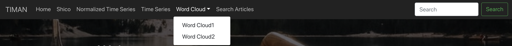
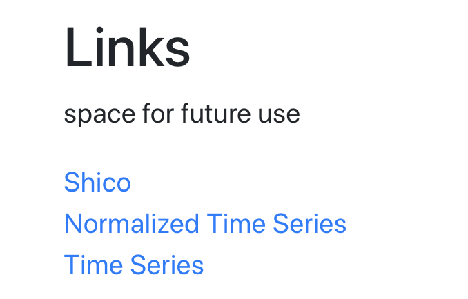
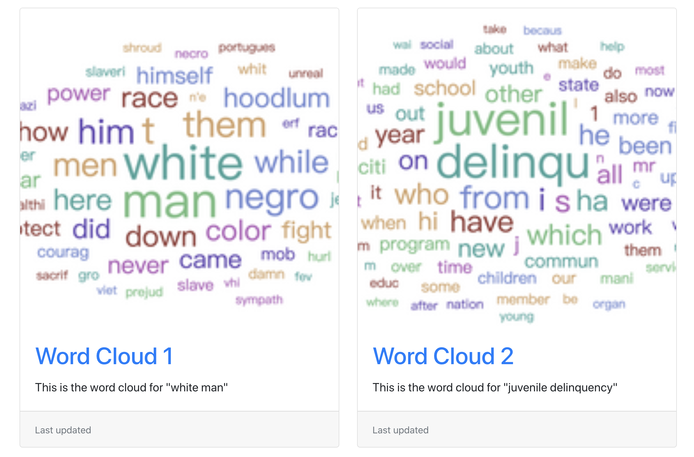
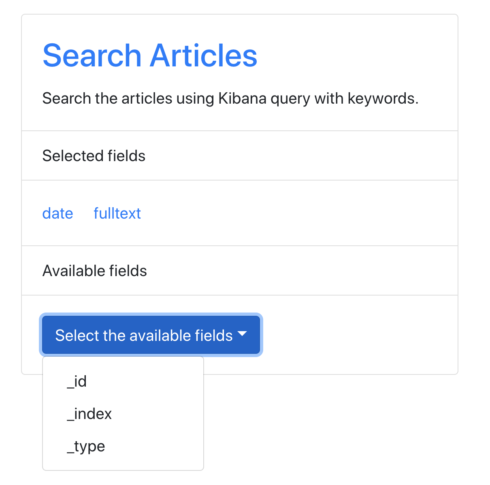

# TIMAN --  An Integrated website for Historical Newspaper Collections Research

## What?
We aim to build an integrated website for users to upload the files and the system will do text analysis, visualizations and queries automatically, currently we have some links and basic functions.

### Navigation Bar


### Links


### Word Cloud


### Search Articles


## How to run the code?
You can use the following command to run the code:
```
npm start
```